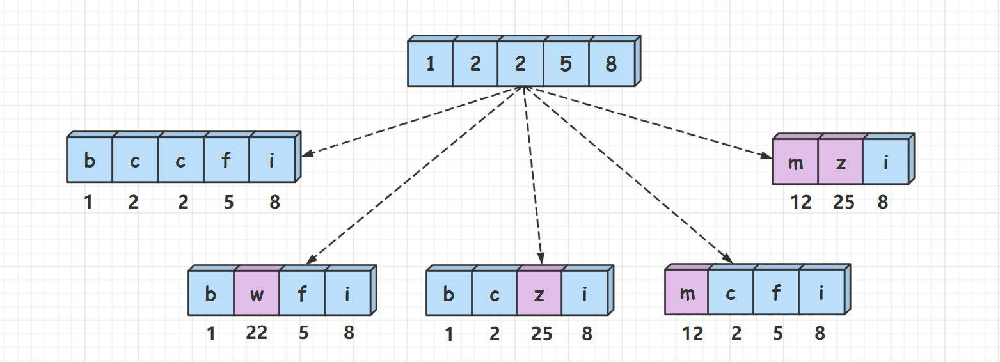
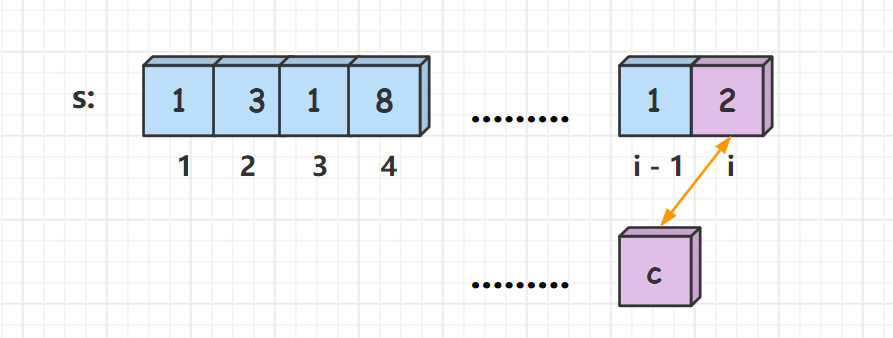
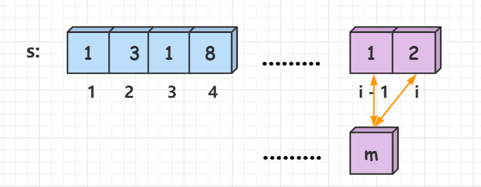

# [LCR 165. 解密数字](https://leetcode.cn/problems/ba-shu-zi-fan-yi-cheng-zi-fu-chuan-lcof?envType=study-plan-v2&envId=coding-interviews)

## 题目：
现有一串神秘的密文 ciphertext，经调查，密文的特点和规则如下：

密文由非负整数组成
数字 0-25 分别对应字母 a-z
请根据上述规则将密文 ciphertext 解密为字母，并返回共有多少种解密结果。

 

 

示例 1:

输入: ciphertext = 216612
输出: 6
解释: 216612 解密后有 6 种不同的形式，分别是 "cbggbc"，"vggbc"，"vggm"，"cbggm"，"cqgbc" 和 "cqgm" 
 

提示：

0 <= ciphertext < 231

## 解题思路：
**本人一点都不会，完全照搬题解大佬和官方题解的思路思路**
(动态规划) O(logn)

给定我们一个数字num，按照题目所给定的规则将其翻译成字符串，问一个数字有多少种不同的翻译方法。

样例：



我们先来理解一下题目的翻译规则，如样例所示，num = 12258，可以分为两种情况：

1、将每一位单独翻译，因此可以翻译成"bccfi"。
2、将相邻两位组合起来翻译（组合的数字范围在10 ~ 25之间），因此可以翻译成"bwfi", "bczi", "mcfi"和"mzi"。
两种情况是或的关系，互不影响，将其相加，那么12258共有5种不同的翻译方式。为了可以很方便的将数字的相邻两位组合起来，我们可以先将数字num转化成字符串数组s[]，下面来讲解动态规划的做法。

状态表示：

我们定义f[i]表示前i个数字一共有多少种不同的翻译方法。那么，f[n]就表示前n个数字一共有多少种不同的翻译方法，即为答案。

状态计算:

假设字符串数组为s[]，对于第i个数字，分成两种决策：

1、单独翻译s[i]。由于求的是方案数，如果确定了第i个数字的翻译方式，那么翻译前i个数字和翻译前i - 1个数的方法数就是相同的，即f[i] = f[i - 1]。(s[]数组下标从1开始)


2、将s[i]和s[i - 1]组合起来翻译(组合的数字范围在10 ~ 25之间)。如果确定了第i个数和第i - 1个数的翻译方式，那么翻译前i个数字和翻译前i - 2个数的翻译方法数就是相同的，即f[i] = f[i - 2]。(s[]数组下标从1开始)


最后将两种决策的方案数加起来，因此，状态转移方程为： f[i] = f[i - 1] + f[i - 2]。

初始化：

f[0] = 1，翻译前0个数的方法数为1。

为什么一个数字都没有的方案数是1？

f[0]代表翻译前0个数字的方法数，这样的状态定义其实是没有实际意义的，但是f[0]的值需要保证边界是对的，即f[1]和f[2]是对的。比如说，翻译前1个数只有一种方法，将其单独翻译，即f[1] = f[1 - 1] = 1。翻译前两个数，如果第1个数和第2个数可以组合起来翻译，那么f[2] = f[1] + f[0] = 2 ，否则只能单独翻译第2个数，即f[2] = f[1] = 1。因此，在任何情况下f[0]取1都可以保证f[1]和f[2]是正确的，所以f[0]应该取1。

实现细节:

我们将数字num转为字符串数组s[]，在推导状态转移方程时，假设的s[]数组下标是从1开始的，而实际中的s[]数组下标是从0开始的，为了一 一对应，在取组合数字的值时，要把s[i - 1] 和 s[i]的值往前错一位，取s[i - 1]和s[i - 2]，即组合值t = (s[i - 2] - '0') * 10 + s[i - 1] - '0'。

在推导状态转移方程时，一般都是默认数组下标从1开始，这样的状态表示可以和实际数组相对应，理解起来会更清晰，但在实际计算中要错位一下，希望大家注意下。

### 代码
我结合了一下官方的解法和楼主的理念改了一下
```c++
class Solution {
public:
int crackNumber(int ciphertext) {
        string src = to_string(ciphertext);
        int n = src.size();

        // 创建f数组，用于存储每一步的翻译方案数
        vector<int> f(n + 1, 0);

        // 初始化
        f[0] = 1; // 空字符串有1种翻译方式
        f[1] = 1; // 第一个字符只能单独翻译，只有1种方式

        // 动态规划填表
        for (int i = 2; i <= n; ++i) {
            // 处理单字符翻译（当前字符独立翻译）
            f[i] = f[i - 1];

            // 处理双字符翻译（前一个字符和当前字符组合翻译）
            string pre = src.substr(i - 2, 2); // 取出前两位组成的字符串
            if (pre >= "10" && pre <= "25") {
                f[i] += f[i - 2]; // 如果合法，则加上f[i-2]的方案数
            }
        }

        return f[n]; // 返回总的翻译方案数
    }
};

```
### 复杂度分析：
时间复杂度分析： O(logn)，计算的次数是nums的位数，即logn​，以10为底。

空间复杂度分析： O(n)。

## Reference
1. 参考来源作者：林小鹿
2. 链接：https://leetcode.cn/problems/ba-shu-zi-fan-yi-cheng-zi-fu-chuan-lcof/solutions/1034242/ba-shu-zi-fan-yi-cheng-zi-fu-chuan-tu-ji-z45c/
3. 力扣官方题解
4. https://leetcode.cn/problems/ba-shu-zi-fan-yi-cheng-zi-fu-chuan-lcof/solutions/280198/ba-shu-zi-fan-yi-cheng-zi-fu-chuan-by-leetcode-sol