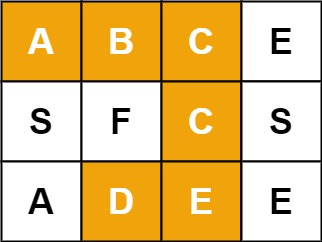
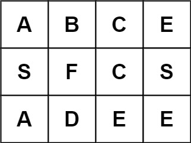

# [LCR 129. 字母迷宫](https://leetcode.cn/problems/ju-zhen-zhong-de-lu-jing-lcof?envType=study-plan-v2&envId=coding-interviews)

## 题目：
字母迷宫游戏初始界面记作 m x n 二维字符串数组 grid，请判断玩家是否能在 grid 中找到目标单词 target。
注意：寻找单词时 必须 按照字母顺序，通过水平或垂直方向相邻的单元格内的字母构成，同时，同一个单元格内的字母 不允许被重复使用 。



示例 1：

输入：grid = [["A","B","C","E"],["S","F","C","S"],["A","D","E","E"]], target = "ABCCED"
输出：true
示例 2：

输入：grid = [["A","B","C","E"],["S","F","C","S"],["A","D","E","E"]], target = "SEE"
输出：true
示例 3：

输入：grid = [["A","B","C","E"],["S","F","C","S"],["A","D","E","E"]], target = "ABCB"
输出：false
 

提示：

m == grid.length
n = grid[i].length
1 <= m, n <= 6
1 <= target.length <= 15
grid 和 target 仅由大小写英文字母组成

## 解题思路：
思路来源于leetcode题解的灵茶山艾府。

### 前置知识
做本题前，你需要有一些网格图 DFS 的经验和回溯的经验。

关于网格图 DFS，可以做做 [200. 岛屿数量](https://leetcode.cn/problems/number-of-islands/)。
关于回溯，可以看[基础算法精讲 14](https://leetcode.cn/link/?target=https%3A%2F%2Fwww.bilibili.com%2Fvideo%2FBV1mG4y1A7Gu%2F)。
### 基本思路（优化前）
枚举 i=0,1,2,⋯,m−1 和 j=0,1,2,⋯,n−1，以 (i,j) 为起点开始搜索。

同时，我们还需要知道当前匹配到了 target 的第几个字母，所以还需要一个参数 k。

定义 dfs(i,j,k) 表示当前在 grid[i][j] 这个格子，要匹配 target[k]，返回在这个状态下最终能否匹配成功（搜索成功）。

分类讨论：

+ 如果 grid[i][j] != target[k]，匹配失败，返回 false。
+ 否则，如果 k=len(target)−1，匹配成功，返回 true。
+ 否则，枚举 (i,j) 周围的四个相邻格子 (x,y)，如果 (x,y) 没有出界，则递归 dfs(x,y,k+1)，如果其返回 true，则 dfs(i,j,k) 也返回 true。
+ 如果递归周围的四个相邻格子都没有返回 true，则最后返回 false，表示没有搜到。
### 细节：

+ 递归过程中，为了避免重复访问同一个格子，可以用 vis 数组标记。更简单的做法是，直接修改 grid[i][j]，将其置为空（或者 0），返回 false 前再恢复成原来的值（恢复现场）。注意返回 true 的时候就不用恢复现场了，因为已经成功搜到 target 了。

### 代码
```c++
class Solution {
    static constexpr int DIRS[4][2] = {{0, 1}, {0, -1}, {1, 0}, {-1, 0}};
public:
    bool wordPuzzle(vector<vector<char>>& grid, string target) {
        int m = grid.size(), n = grid[0].size();
        auto dfs = [&](auto&& dfs, int i, int j, int k) -> bool {
            if (grid[i][j] != target[k]) { // 匹配失败
                return false;
            }
            if (k + 1 == target.length()) { // 匹配成功！
                return true;
            }
            grid[i][j] = 0; // 标记访问过
            for (auto& [dx, dy] : DIRS) {
                int x = i + dx, y = j + dy; // 相邻格子
                if (0 <= x && x < m && 0 <= y && y < n && dfs(dfs, x, y, k + 1)) {
                    return true; // 搜到了！
                }
            }
            grid[i][j] = target[k]; // 恢复现场
            return false; // 没搜到
        };
        for (int i = 0; i < m; i++) {
            for (int j = 0; j < n; j++) {
                if (dfs(dfs, i, j, 0)) {
                    return true; // 搜到了！
                }
            }
        }
        return false; // 没搜到
    }
};

```
### 第一个优化


比如示例 3，target=ABCB，其中字母 B 出现了 2 次，但 grid 中只有 1 个字母 B，所以肯定搜不到 target，直接返回 false。

一般地，如果 target 的某个字母的出现次数，比 grid 中的这个字母的出现次数还要多，可以直接返回 false。

### 第二个优化
设 target 的第一个字母在 grid 中的出现了 x 次，target 的最后一个字母在 grid 中的出现了 y 次。

如果 y<x，我们可以把 target 反转，相当于从 target 的最后一个字母开始搜索，这样更容易在一开始就满足 grid[i][j] != target[k]，不会往下递归，递归的总次数更少。

加上这两个优化，就可以击败接近 100% 了！其中 Java、C++、Go 和 Rust 可以跑到 0ms。
```c++
class Solution {
    static constexpr int DIRS[4][2] = {{0, 1}, {0, -1}, {1, 0}, {-1, 0}};
public:
    bool wordPuzzle(vector<vector<char>>& grid, string target) {
        unordered_map<char, int> cnt;
        for (auto& row : grid) {
            for (char c : row) {
                cnt[c]++;
            }
        }

        // 优化一
        unordered_map<char, int> target_cnt;
        for (char c : target) {
            if (++target_cnt[c] > cnt[c]) {
                return false;
            }
        }

        // 优化二
        if (cnt[target.back()] < cnt[target[0]]) {
            ranges::reverse(target);
        }

        int m = grid.size(), n = grid[0].size();
        auto dfs = [&](auto&& dfs, int i, int j, int k) -> bool {
            if (grid[i][j] != target[k]) { // 匹配失败
                return false;
            }
            if (k + 1 == target.length()) { // 匹配成功！
                return true;
            }
            grid[i][j] = 0; // 标记访问过
            for (auto& [dx, dy] : DIRS) {
                int x = i + dx, y = j + dy; // 相邻格子
                if (0 <= x && x < m && 0 <= y && y < n && dfs(dfs, x, y, k + 1)) {
                    return true; // 搜到了！
                }
            }
            grid[i][j] = target[k]; // 恢复现场
            return false; // 没搜到
        };
        for (int i = 0; i < m; i++) {
            for (int j = 0; j < n; j++) {
                if (dfs(dfs, i, j, 0)) {
                    return true; // 搜到了！
                }
            }
        }
        return false; // 没搜到
    }
};
```
### 复杂度分析
时间复杂度：O(mn3^k)，其中 m 和 n 分别为 grid 的行数和列数，k 是 target 的长度。除了递归入口，其余递归至多有 3 个分支（因为至少有一个方向是之前走过的），所以每次递归（回溯）的时间复杂度为 O(3^k)，一共回溯 O(mn) 次，所以时间复杂度为 O(mn3^k)。
空间复杂度：O(∣Σ∣+k)。其中 ∣Σ∣=52 是字符集合的大小。递归需要 O(k) 的栈空间。部分语言用的数组代替哈希表，可以视作 ∣Σ∣=128。

### 我的代码（附带注释）
```c++
class Solution {
    static constexpr int DIRS[4][2] = {{0, 1}, {0, -1}, {1, 0}, {-1, 0}};

public:
    bool wordPuzzle(vector<vector<char>>& grid, string target) {
        unordered_map<char, int> cnt;
        for (auto& row : grid) {
            for (char c : row) {
                cnt[c]++;
            }
        }

        // 优化一
        unordered_map<char, int> target_cnt;
        for (char c : target) {
            if (++target_cnt[c] > cnt[c]) {
                return false;
            }
        }

        // 优化二
        if (cnt[target.back()] < cnt[target[0]]) {
            ranges::reverse(target);
        }

        int m = grid.size();
        int n = grid[0].size();

        auto dfs = [&](auto&& dfs, int i, int j, int k) -> bool {
            /*
            参数解释：
                - `[&]`：捕获外部作用域中的所有变量，以引用的方式使用，确保
            lambda 可以访问grid、target、DIRS、m、n 等变量。
                - `auto&& dfs`：递归函数自引用，允许 lambda 表达式递归调用自身。
                - `int i, int j`：当前搜索的位置坐标，表示 grid 的行和列。
                - `int k`：当前正在匹配的 target 字符串的索引位置。
                - `-> bool`：返回类型，表示是否成功匹配到 target。
            */
            if (grid[i][j] != target[k]) {
                return false;
            }
            if (k + 1 == target.length()) {
                // k + 1 == target.length()：意味着已经匹配到了 target
                // 的最后一个字符，
                // 并且成功匹配到了 target 中所有字符。这是因为 k 从 0
                // 开始计数， 如果 k + 1 等于 target 的长度，表示 k 正好是
                // target 的最后一个字符的位置。
                return true;
            }
            grid[i][j] = 0; // 标记访问过
            for (auto& [dx, dy] : DIRS) {
                int x = i + dx, y = j + dy; // 相邻格子
                if (0 <= x && x < m && 0 <= y && y < n &&
                    dfs(dfs, x, y, k + 1)) {
                    return true;
                    /*
                    解释：
                        - `0 <= x && x < m` 和 `0 <= y && y < n`：
                        确保相邻格子 `(x, y)` 在 grid 范围内，不越界。
                        - `dfs(dfs, x, y, k + 1)`：
                        递归调用，从新的位置 `(x, y)` 继续匹配 target
                    的下一个字符 `k + 1`。 如果递归返回
                    `true`，表示找到了一条完整的匹配路径。
                        - 整个条件：
                        检查 `(x, y)` 是否有效位置，并在该位置继续匹配。
                        只要找到一个符合条件的路径，就返回
                    `true`，表示匹配成功。
                    */
                }
            }
            grid[i][j] = target[k]; // 恢复现场
            return false;           // 没搜到
        };
        for (int i = 0; i < m; i++) {
            for (int j = 0; j < n; j++) {
                if (dfs(dfs, i, j, 0)) {
                    return true;
                }
            }
        }
        return false;
    }
};
```

## Reference
1. 参考来源作者：灵茶山艾府
2. 链接：https://leetcode.cn/problems/ju-zhen-zhong-de-lu-jing-lcof/solutions/2962452/ji-zhi-you-hua-dai-ma-ji-bai-jie-jin-100-1w79/
来源：力扣（LeetCode）
著作权归作者所有。商业转载请联系作者获得授权，非商业转载请注明出处。