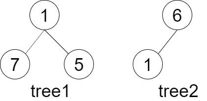
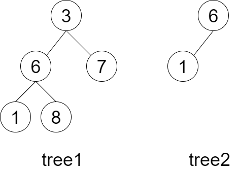
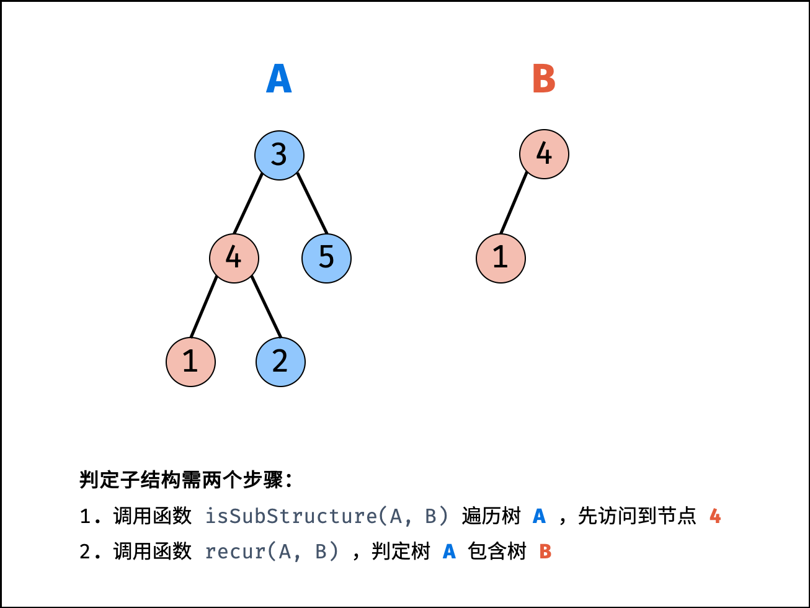

# [LCR 143. 子结构判断](https://leetcode.cn/problems/shu-de-zi-jie-gou-lcof?envType=study-plan-v2&envId=coding-interviews)

## 题目：
给定两棵二叉树 tree1 和 tree2，判断 tree2 是否以 tree1 的某个节点为根的子树具有 相同的结构和节点值 。
注意，空树 不会是以 tree1 的某个节点为根的子树具有 相同的结构和节点值 。

 

示例 1：



输入：tree1 = [1,7,5], tree2 = [6,1]
输出：false
解释：tree2 与 tree1 的一个子树没有相同的结构和节点值。
示例 2：



输入：tree1 = [3,6,7,1,8], tree2 = [6,1]
输出：true
解释：tree2 与 tree1 的一个子树拥有相同的结构和节点值。即 6 - > 1。
 

提示：

0 <= 节点个数 <= 10000

## 解题思路：
若树 B 是树 A 的子结构，则子结构的根节点可能为树 A 的任意一个节点。因此，判断树 B 是否是树 A 的子结构，需完成以下两步工作：

先序遍历树 A 中的每个节点 node ；（对应函数 isSubStructure(A, B)）
判断树 A 中以 node 为根节点的子树是否包含树 B 。（对应函数 recur(A, B)）



算法流程：
本文名词规定：树 A 的根节点记作 节点 A ，树 B 的根节点称为 节点 B 。

recur(A, B) 函数：

终止条件：
当节点 B 为空：说明树 B 已匹配完成（越过叶子节点），因此返回 true ；
当节点 A 为空：说明已经越过树 A 的叶节点，即匹配失败，返回 false ；
当节点 A 和 B 的值不同：说明匹配失败，返回 false ；
返回值：
判断 A 和 B 的 左子节点 是否相等，即 recur(A.left, B.left) ；
判断 A 和 B 的 右子节点 是否相等，即 recur(A.right, B.right) ；
isSubStructure(A, B) 函数：

特例处理： 当 树 A 为空 或 树 B 为空 时，直接返回 false ；
返回值： 若树 B 是树 A 的子结构，则必满足以下三种情况之一，因此用或 || 连接；
以 节点 A 为根节点的子树 包含树 B ，对应 recur(A, B)；
树 B 是 树 A 左子树 的子结构，对应 isSubStructure(A.left, B)；
树 B 是 树 A 右子树 的子结构，对应 isSubStructure(A.right, B)；

### 代码

#### 别人的代码
题解里面有一个人写的注释很好，我直接搬上来：
```java

// Author: Fomalhaut🥝

class Solution {
    /*
    参考:数据结构与算法的题解比较好懂
    死死记住isSubStructure()的定义:判断B是否为A的子结构
    */
    public boolean isSubStructure(TreeNode A, TreeNode B) {
        // 若A与B其中一个为空,立即返回false
        if(A == null || B == null) {
            return false;
        }
        // B为A的子结构有3种情况,满足任意一种即可:
        // 1.B的子结构起点为A的根节点,此时结果为recur(A,B)
        // 2.B的子结构起点隐藏在A的左子树中,而不是直接为A的根节点,此时结果为isSubStructure(A.left, B)
        // 3.B的子结构起点隐藏在A的右子树中,此时结果为isSubStructure(A.right, B)
        return recur(A, B) || isSubStructure(A.left, B) || isSubStructure(A.right, B);
    }

    /*
    判断B是否为A的子结构,其中B子结构的起点为A的根节点
    */
    private boolean recur(TreeNode A, TreeNode B) {
        // 若B走完了,说明查找完毕,B为A的子结构
        if(B == null) {
            return true;
        }
        // 若B不为空并且A为空或者A与B的值不相等,直接可以判断B不是A的子结构
        if(A == null || A.val != B.val) {
            return false;
        }
        // 当A与B当前节点值相等,若要判断B为A的子结构
        // 还需要判断B的左子树是否为A左子树的子结构 && B的右子树是否为A右子树的子结构
        // 若两者都满足就说明B是A的子结构,并且该子结构以A根节点为起点
        return recur(A.left, B.left) && recur(A.right, B.right);
    }
}
```

#### 我的代码
```c++
// /**
//  * Definition for a binary tree node.
//  * struct TreeNode {
//  *     int val;
//  *     TreeNode *left;
//  *     TreeNode *right;
//  *     TreeNode() : val(0), left(nullptr), right(nullptr) {}
//  *     TreeNode(int x) : val(x), left(nullptr), right(nullptr) {}
//  *     TreeNode(int x, TreeNode *left, TreeNode *right) : val(x),
left(left),
//  * right(right) {}
//  * };
//  */
class Solution {
public:
    bool isSubStructure(TreeNode* A, TreeNode* B) {
        if (A == nullptr || B == nullptr) {
            return false;
        }
        // 判断B子结构起点就是A子结构起点
        // 判断B的子结构隐藏在A的左子树
        // 判断B的子结构隐藏在A的右子树
        return recur(A, B) || isSubStructure(A->left, B) ||
               isSubStructure(A->right, B);
    }

private:
    // 判断是否B是A子节点或者B是否是A的隐藏子节点
    bool recur(TreeNode* A, TreeNode* B) {
        // B走完了，说明查找完毕，是子节点
        if (B == nullptr)
            return true;

        // 1. B不是A的子节点
        if (A == nullptr || A->val != B->val)
            return false;

        // 2. A，B的值相等，此时需要判断按他们的子节点是否相等
        //  分别判断他们的左节点和右节点
        return recur(A->left, B->left) && recur(A->right, B->right);
    }
};
```

## Reference
1. 参考来源作者：Krahets
2. 链接：https://leetcode.cn/problems/shu-de-zi-jie-gou-lcof/solutions/144306/mian-shi-ti-26-shu-de-zi-jie-gou-xian-xu-bian-li-p/
