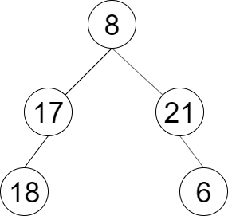

# [LCR 149. 彩灯装饰记录 I](https://leetcode.cn/problems/cong-shang-dao-xia-da-yin-er-cha-shu-lcof?envType=study-plan-v2&envId=coding-interviews)

## 题目：
一棵圣诞树记作根节点为 root 的二叉树，节点值为该位置装饰彩灯的颜色编号。请按照从 左 到 右 的顺序返回每一层彩灯编号。

示例 1：
输入：root = [8,17,21,18,null,null,6]
输出：[8,17,21,18,6]
 

提示：

节点总数 <= 1000
## 解题思路：
思路来源于**灵茶山艾府**大佬的[BFS 为什么要用队列？一个视频讲透！（Python/Java/C++/Go/JS](https://leetcode.cn/problems/cong-shang-dao-xia-da-yin-er-cha-shu-lcof/solutions/2347369/bfs-wei-shi-yao-yao-yong-dui-lie-yi-ge-s-ji8i)

总结就是用两个数组，一个current数组存储当前层的节点，另一个next数组存储下一层的节点。

要完成的事有判断当前层的左右节点是否并不为空，不为空的话添加到nxt数组。

### 代码
```c++
/**
 * Definition for a binary tree node.
 * struct TreeNode {
 *     int val;
 *     TreeNode *left;
 *     TreeNode *right;
 *     TreeNode() : val(0), left(nullptr), right(nullptr) {}
 *     TreeNode(int x) : val(x), left(nullptr), right(nullptr) {}
 *     TreeNode(int x, TreeNode *left, TreeNode *right) : val(x), left(left),
 * right(right) {}
 * };
 */
class Solution {
public:
    vector<int> decorateRecord(TreeNode* root) {
        if (root == nullptr)
            return {};
        vector<int> ans;
        vector<TreeNode*> cur = {root};

        while (cur.size()) {
            vector<TreeNode*> nxt;
            for (auto node : cur) {
                ans.push_back(node->val); // 先把当前层的值存到ans
                if (node->left)
                    nxt.push_back(node->left); // 先看左节点
                if (node->right)
                    nxt.push_back(node->right); // 再看优点
            }
            cur = move(nxt); // nxt下层节点转移给cur
        }
        return ans;
    }
};
```

### 复杂度分析：
+ 时间复杂度：O(n)，其中 n 为二叉树的节点个数。
+ 空间复杂度：O(n)。满二叉树（每一层都填满）最后一层有大约 n/2 个节点，因此数组中最多有 O(n) 个元素，所以空间复杂度是 O(n) 的。

## Reference
1. 思路来源：灵茶山艾府
2. 链接：https://leetcode.cn/problems/cong-shang-dao-xia-da-yin-er-cha-shu-lcof/solutions/2347369/bfs-wei-shi-yao-yao-yong-dui-lie-yi-ge-s-ji8i/
