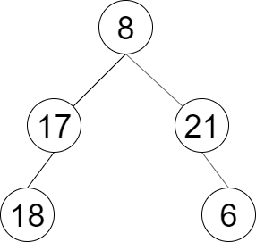

# [LCR 151. 彩灯装饰记录 III](https://leetcode.cn/problems/cong-shang-dao-xia-da-yin-er-cha-shu-iii-lcof?envType=study-plan-v2&envId=coding-interviews)

## 题目：
一棵圣诞树记作根节点为 root 的二叉树，节点值为该位置装饰彩灯的颜色编号。请按照如下规则记录彩灯装饰结果：

第一层按照从左到右的顺序记录
除第一层外每一层的记录顺序均与上一层相反。即第一层为从左到右，第二层为从右到左。

示例 1：


输入：root = [8,17,21,18,null,null,6]
输出：[[8],[21,17],[18,6]]
 

提示：
`节点总数 <= 1000`

## 解题思路：
和[LCR 149 彩灯装饰记录](/搜索与回溯算法/LCR%20149.%20彩灯装饰记录%20I.md)类似，但是有几点要注意：
1. 返回的值的类型变了，现在是vector<vector<int>>，149是vector<int>
2. 可以注意到双数层的值是反转过来的，所以需要用一个boolean值去判断是不是偶数层
3. 用emplace_back()在复杂的情况下，比push_back()节省性能(`emplace_back` 在需要 **直接构造对象** 时比 `push_back` 更节省性能，因为它避免了创建临时对象或复制对象的开销。`emplace_back` 直接在容器末尾构造对象，而 `push_back` 需要先构造对象然后再复制或移动它到容器中。)

### 题解代码：
```c++
class Solution {
public:
    vector<vector<int>> decorateRecord(TreeNode *root) {
        if (root == nullptr) return {};
        vector<vector<int>> ans;
        vector<TreeNode *> cur = {root};
        for (bool even = false; !cur.empty(); even = !even) {
            vector<TreeNode *> nxt;
            vector<int> vals;
            for (auto node : cur) {
                vals.push_back(node->val);
                if (node->left)  nxt.push_back(node->left);
                if (node->right) nxt.push_back(node->right);
            }
            cur = move(nxt);
            if (even) reverse(vals.begin(), vals.end());
            ans.emplace_back(vals);
        }
        return ans;
    }
};

作者：灵茶山艾府
链接：https://leetcode.cn/problems/cong-shang-dao-xia-da-yin-er-cha-shu-iii-lcof/solutions/2349012/bfs-wei-shi-yao-yao-yong-dui-lie-yi-ge-s-yxdi/
来源：力扣（LeetCode）
著作权归作者所有。商业转载请联系作者获得授权，非商业转载请注明出处。
```

### 我的代码
```c++
class Solution {
public:
    vector<vector<int>> decorateRecord(TreeNode* root) {
        if (root == nullptr) {
            return {};
        }
        vector<TreeNode*> cur = {root};
        vector<vector<int>> ans;
        bool even = false;

        while (cur.size()) {
            vector<TreeNode*> nxt;
            vector<int> vals;
            for (auto node : cur) {
                vals.push_back(node->val);
                if (node->left)
                    nxt.push_back(node->left);
                if (node->right)
                    nxt.push_back(node->right);
            }
            cur = move(nxt);
            if (even)
                reverse(vals.begin(), vals.end());
            ans.emplace_back(vals);
            even = !even;
        }
        return ans;
    }
};
```
区别是我为了方便理解，我依旧使用while，我把判断even设置放到外面了

## 复杂度分析
+ 时间复杂度：O(n)，其中 n 为二叉树的节点个数。
+ 空间复杂度：O(n)。满二叉树（每一层都填满）最后一层有大约 n/2 个节点，因此数组中最多有 O(n) 个元素，所以空间复杂度是 O(n) 的。

## Reference
1. 思路来源：灵茶山艾府
2. 链接：https://leetcode.cn/problems/cong-shang-dao-xia-da-yin-er-cha-shu-iii-lcof/solutions/2349012/bfs-wei-shi-yao-yao-yong-dui-lie-yi-ge-s-yxdi/