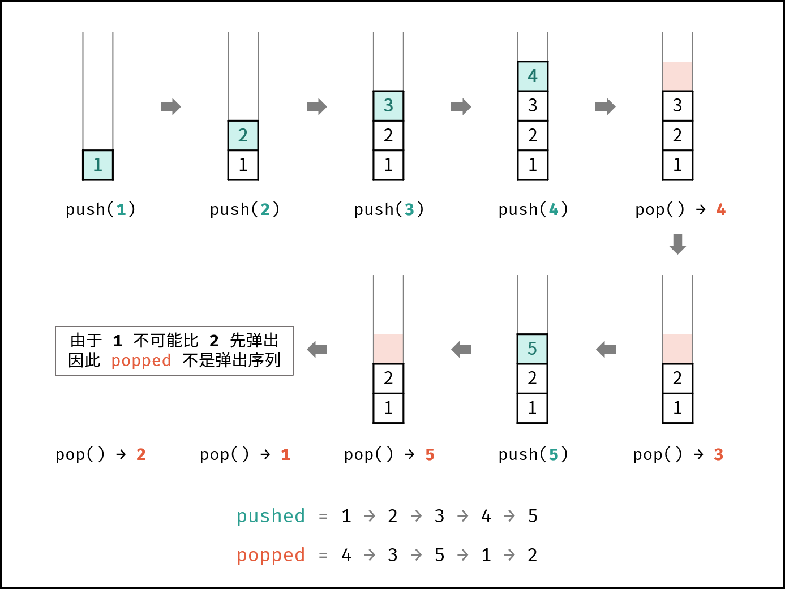

# LCR 148. 验证图书取出顺序

## 题目：
现在图书馆有一堆图书需要放入书架，并且图书馆的书架是一种特殊的数据结构，只能按照 一定 的顺序 放入 和 拿取 书籍。

给定一个表示图书放入顺序的整数序列 putIn，请判断序列 takeOut 是否为按照正确的顺序拿取书籍的操作序列。你可以假设放入书架的所有书籍编号都不相同。

 

示例 1：

输入：putIn = [6,7,8,9,10,11], takeOut = [9,11,10,8,7,6]
输出：true
解释：我们可以按以下操作放入并拿取书籍：
push(6), push(7), push(8), push(9), pop() -> 9,
push(10), push(11),pop() -> 11,pop() -> 10, pop() -> 8, pop() -> 7, pop() -> 6
示例 2：

输入：putIn = [6,7,8,9,10,11], takeOut = [11,9,8,10,6,7]
输出：false
解释：6 不能在 7 之前取出。
 

提示：

0 <= putIn.length == takeOut.length <= 1000
0 <= putIn[i], takeOut < 1000
putIn 是 takeOut 的排列。
注意：本题与主站 946 题相同：https://leetcode-cn.com/problems/validate-stack-sequences/

## 解题思路：
思路来源于leetcode题解的K神。
如下图所示，给定一个放入序列 putIn 和拿取序列 takeOut ，则放入（压栈）和拿取（弹出）操作的顺序是 唯一确定 的。

上图这种操作是不可以的，所以我们要一检测到有满足条件的就出栈。
**换句话说：在遇到 “栈顶元素 = 拿取序列的当前元素” 就应立即执行出栈。**

### 代码思路
考虑借用一个辅助栈 stack ，模拟 放入 / 拿取操作的排列。根据是否模拟成功，即可得到结果。

- 入栈操作： 按照压栈序列的顺序执行。
- 出栈操作： 每次入栈后，循环判断 “栈顶元素 = 拿取序列的当前元素” 是否成立，将符合拿取序列顺序的栈顶元素全部拿取。

### 算法流程：
1. 初始化： 辅助栈 stack ，拿取序列的索引 i ；
2. 遍历压栈序列： 各元素记为 num ；
    a. 元素 num 入栈；
    b.循环出栈：若 stack 的栈顶元素 = 拿取序列元素 takeOut[i] ，则执行出栈与 i++ ；
3. 返回值： 若 stack 为空，则此拿取序列合法。

### 代码
```c++
class Solution {
public:
    bool validateBookSequences(vector<int>& putIn, vector<int>& takeOut) {
        stack <int> stack;
        int i = 0;
        for (int num : putIn) {
            stack.push(num);
            while (!stack.empty() && stack.top() == takeOut[i]) {
                stack.pop();
                i++;
            }
        }
        return stack.empty();
    }
};
```

### 复杂度分析：
时间复杂度 O(N) ： 其中 N 为列表 putIn 的长度；每个元素最多入栈与出栈一次，即最多共 2N 次出入栈操作。
空间复杂度 O(N) ： 辅助栈 stack 最多同时存储 N 个元素。

## Reference
1. 参考来源作者：Krahets
2. 链接：https://leetcode.cn/problems/zhan-de-ya-ru-dan-chu-xu-lie-lcof/description/

